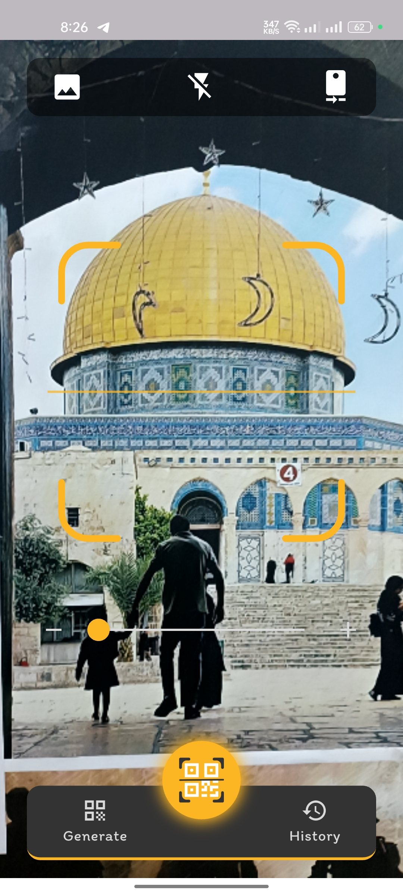
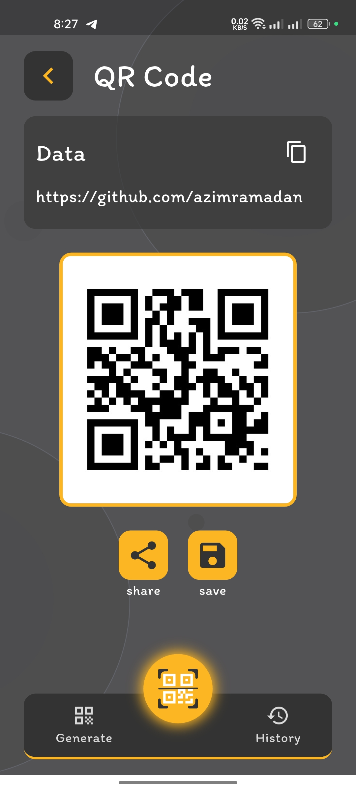
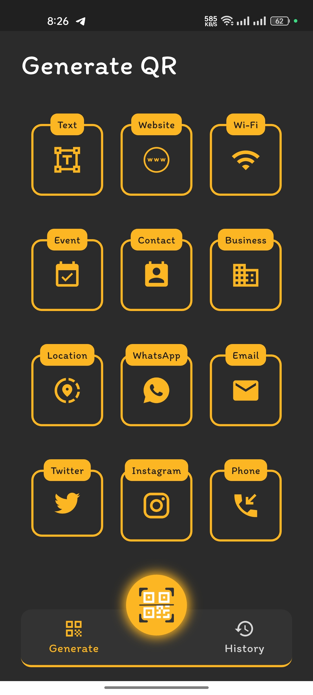
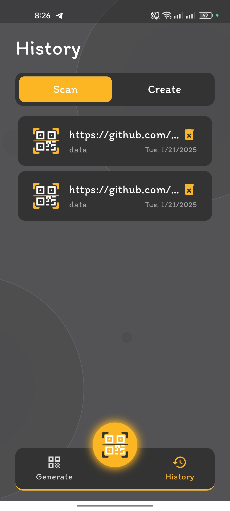

# QR Code Generator & Scanner 📱🔍


QR Code Generator & Scanner is a Flutter application that allows you to easily generate and scan QR codes. The app supports various types of data such as links, phone numbers, text, websites, Wi-Fi, events, contacts, and more! 🌐📲

---

## Key Features ✨

- **Scan QR Codes**: Scan QR codes using your camera and store them in the scan history. 📸
- **Generate QR Codes**: Generate QR codes for different types of data such as:
  - Text 📝
  - Websites 🌐
  - Wi-Fi Networks 📶
  - Events 📅
  - Contacts 📞
  - Emails 📧
  - And much more! 🚀
- **Scan & Generate History**: All scanned and generated QR codes are stored in a history log for easy access. 📚
- **Share & Save QR Codes**: Share generated QR codes with others or save them to your device. (Save feature coming soon) 💾

---

## Technologies Used 🛠️

- **Flutter**: A cross-platform framework for building beautiful and efficient user interfaces.
- **Dart**: The programming language used for Flutter development.
- **Hive**: A lightweight and fast NoSQL database for local storage.
- **Mobile Scanner**: A library for scanning QR codes using the camera.
- **Pretty QR Code**: A library for generating beautifully designed QR codes.

---

## How to Run 🚀

1. Ensure Flutter is installed on your machine. If not, follow the [official installation guide](https://flutter.dev/docs/get-started/install).
2. Clone the repository:
   ```bash
   git clone https://github.com/azimramadan/qr-master.git
3. Navigate to the project directory:
   ```bash
   cd qr-master
4. Install dependencies:
   ```bash
   flutter pub get
5. Run the app:
   ```bash
   flutter run

---

## 📸 Screenshots
<p align="center">
  
  
</p>

---

<p align="center">
  
  
</p>

---

## Upcoming Features 🚧
- Save Images: We will add the ability to save QR codes as images to your device. 💾
- UI Improvements: Enhancements to the user interface for a smoother experience. 🎨
- Support for More Types: Add support for new data types such as business cards, social links, and more. 📇

---

## Contributing 🤝
Contributions are welcome! If you'd like to help, please follow these steps:
1. Fork the project.
2. Create a new branch (git checkout -b feature/AmazingFeature).
3. Make your changes and add them (git add .).
4. Commit your changes (git commit -m 'Add some AmazingFeature')
5. Push to the branch (git push origin feature/AmazingFeature).
6. Open a Pull Request.

---

## Contact 📞

Have questions or suggestions? Feel free to reach out to me!  

- **Email**: [eng.abdelazim3@gmail.com](eng.abdelazim3@gmail.com)  
- **LinkedIn**: [Abdelazim Ramadan](https://www.linkedin.com/in/azimramadan?utm_source=share&utm_campaign=share_via&utm_content=profile&utm_medium=android_app)  
- **Facebook**: [عبدالعظيم رمضان](https://www.facebook.com/share/19pSykEJNM/?mibextid=qi2Omg)  

---

**Enjoy using QR Code Generator & Scanner! 🎉**

